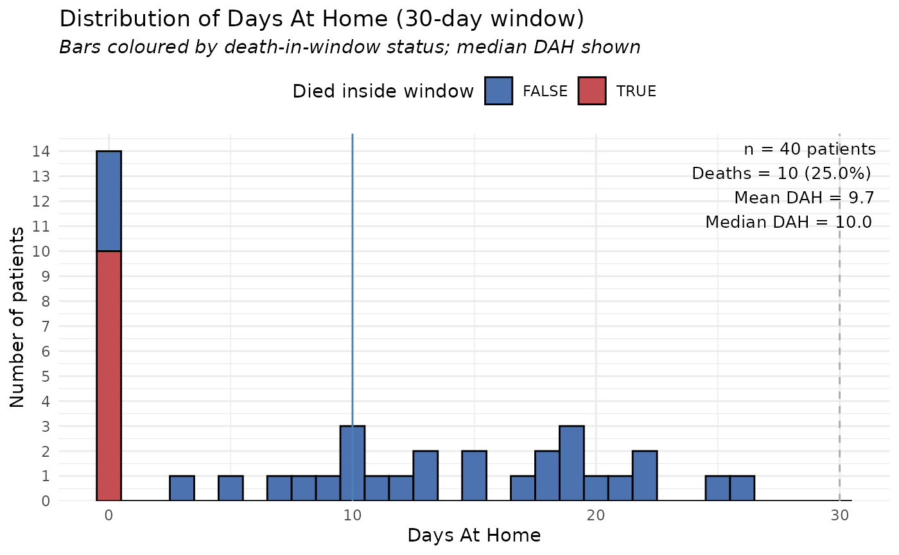

# Get started

## What the DAH pipeline does

The **DAH (Days‑At‑Home)** pipeline takes a *long‑format* table of
clinical events and calculates, for each patient, how many days out of a
user‑defined window (default 30 days) they spent **at home**.

*Primary admission* → start of the window.  
*Hospital* or *rehabilitation* stays → days **not** at home.  
If a patient dies **inside** the window, their DAH is set to **0**.

All column names can be customised; you only need to tell the wrapper
which columns correspond to the required concepts.

------------------------------------------------------------------------

## 1️⃣ Get the package and load the example data set

``` r

pak::pak("agdamsbo/dahcalc")
library(dahcalc)
```

The package ships a reproducible synthetic data set called
`synthetic_data`.

``` r

str(dahcalc::synthetic_data)
#> tibble [131 × 7] (S3: tbl_df/tbl/data.frame)
#>  $ patient_id       : int [1:131] 1 1 1 2 2 2 2 2 3 3 ...
#>  $ event_id         : int [1:131] 1 2 3 1 2 3 4 5 1 2 ...
#>  $ event_type       : chr [1:131] "primary" "rehabilitation" "rehabilitation" "primary" ...
#>  $ start_date       : Date[1:131], format: "2023-08-09" "2023-08-20" ...
#>  $ end_date         : Date[1:131], format: "2023-08-16" "2023-08-30" ...
#>  $ intervention_date: Date[1:131], format: "2023-08-13" NA ...
#>  $ death_date       : Date[1:131], format: NA NA ...
```

The data already have the **canonical column names** that the pipeline
expects:

- `patient_id`
- `event_id`
- `event_type` (`"primary"`, `"hospital"`, `"rehabilitation"` or
  `"death"`)
- `start_date`, `end_date`
- `intervention_date` (only filled for the primary admission)
- `death_date` (filled only for rows of type `"death"`)

------------------------------------------------------------------------

## 2️⃣ (Optional) Rename columns to match your own file

If your own CSV uses different names you can rename them before calling
the pipeline. For demonstration we rename them to a lower‑case scheme,
but you could skip this step entirely if your file already uses the
canonical names.

``` r

# Make a copy so we do not alter the original object
my_dt <- dahcalc::synthetic_data

# Suppose the user’s file uses the following names:
#  pid, eid, etype, adm_start, adm_end, int_date, dod
my_dt <- setNames(
  my_dt,
  c("pid", "eid", "etype", "adm_start",
          "adm_end", "int_date", "dod")
)

head(my_dt)
#> # A tibble: 6 × 7
#>     pid   eid etype          adm_start  adm_end    int_date   dod   
#>   <int> <int> <chr>          <date>     <date>     <date>     <date>
#> 1     1     1 primary        2023-08-09 2023-08-16 2023-08-13 NA    
#> 2     1     2 rehabilitation 2023-08-20 2023-08-30 NA         NA    
#> 3     1     3 rehabilitation 2023-09-01 2023-09-09 NA         NA    
#> 4     2     1 primary        2023-05-01 2023-05-12 2023-05-05 NA    
#> 5     2     2 rehabilitation 2023-05-13 2023-05-17 NA         NA    
#> 6     2     3 rehabilitation 2023-05-22 2023-06-01 NA         NA
```

Now `my_dt` looks like the data a user might supply.

------------------------------------------------------------------------

## 3️⃣ Run the DAH pipeline

Tell the wrapper the names you are using (or skip the arguments if you
kept the canonical names).

``` r

res <- run_dah_pipeline(
  data_long             = my_dt,
  window_days           = 30,        # 30‑day observation window
  patient_id_col        = "pid",
  start_date_col        = "adm_start",
  end_date_col          = "adm_end",
  intervention_date_col = "int_date",
  death_date_col        = "dod",
  verbose               = TRUE
)

names(res)
#> [1] "per_patient"    "cohort_summary" "plot"
```

- `res$per_patient` – one row per patient with DAH values.  
- `res$cohort_summary` – aggregated statistics for the whole cohort.  
- `res$plot` – a ggplot object showing the DAH distribution.

------------------------------------------------------------------------

## 4️⃣ Look at the cohort‑level summary

``` r

print(res$cohort_summary)
#>     window_days n_patients n_deaths mean_dah median_dah sd_dah q25_dah q75_dah
#> 25%          30         40       12     9.68         10   8.72       0      18
#>     pct_full_home mean_effective_window_days dah_per_100_pt_days
#> 25%             0                         30               32.25
```

Typical output shows:

- number of patients,
- mean / median / SD of DAH,
- percentage with **full** 30 days at home,
- DAH per 100 person‑days, etc.

------------------------------------------------------------------------

## 5️⃣ Inspect the per‑patient table

``` r

head(res$per_patient, 10)
#>    patient_id index_date death_date dah institutional_days effective_window
#> 1           1 2023-08-13       <NA>   5                 25               30
#> 2           2 2023-05-05 2023-06-10   0                 30               30
#> 3           3 2023-10-21       <NA>  21                  9               30
#> 4           4 2023-02-18       <NA>  17                 13               30
#> 5           5 2023-04-21 2023-05-03   0                  9               30
#> 6           6 2023-12-22 2024-01-25   0                 34               30
#> 7           7 2023-04-21 2023-05-14   0                 16               30
#> 8           8 2023-06-13       <NA>  13                 17               30
#> 9           9 2023-06-29       <NA>  10                 20               30
#> 10         10 2023-10-16       <NA>  10                 20               30
#>    died_in_window
#> 1           FALSE
#> 2           FALSE
#> 3           FALSE
#> 4           FALSE
#> 5            TRUE
#> 6           FALSE
#> 7            TRUE
#> 8           FALSE
#> 9           FALSE
#> 10          FALSE
```

Key columns you’ll see:

| column | meaning |
|----|----|
| `pid` (or `patient_id`) | patient identifier |
| `dah` | days at home within the window (0 if death occurs inside) |
| `effective_window` | length of the observation window actually used (shorter when death occurs) |
| `institutional_days` | number of days spent in hospital/rehab |
| `died_in_window` | `TRUE` if death happened inside the window |

------------------------------------------------------------------------

## 6️⃣ Visualise the DAH distribution

``` r

print(res$plot)   # displays a histogram with a vertical line at 30 days
```



The histogram lets you quickly see how many patients spent all 30 days
at home, how many had long institutional stays, and where deaths fall.

------------------------------------------------------------------------

## 7️⃣ What to do with your own data

When you have a real CSV file, the workflow is the same:

``` r

my_real_data <- read.csv("my_clinical_file.csv")

# (optional) rename columns if they differ from the canonical ones
# setnames(my_real_data, old = "...", new = "...")

result <- run_dah_pipeline(
  dt_long               = my_real_data,
  patient_id_col        = "my_id",
  start_date_col        = "my_start",
  end_date_col          = "my_end",
  intervention_date_col = "my_intervention",
  death_date_col        = "my_death",
  window_days           = 30,
  keep_original_names   = TRUE
)

# Then explore result$cohort_summary, result$per_patient, result$plot …
```

That’s all you need to obtain **Days‑At‑Home** metrics for any data set
that follows the required event structure.
